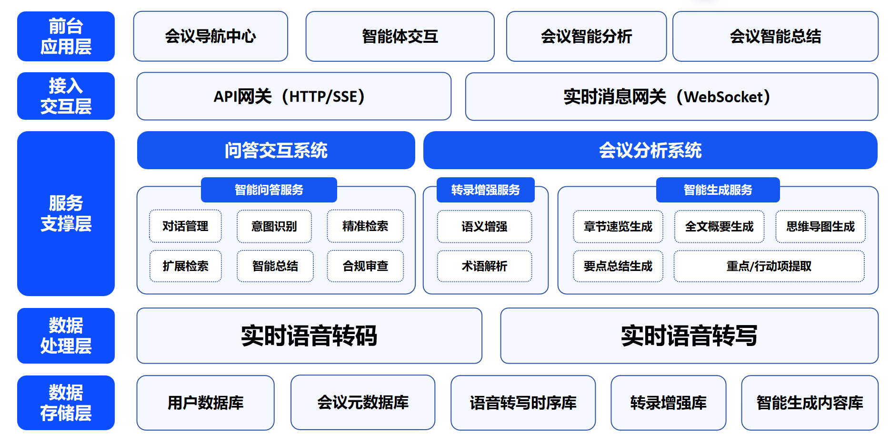
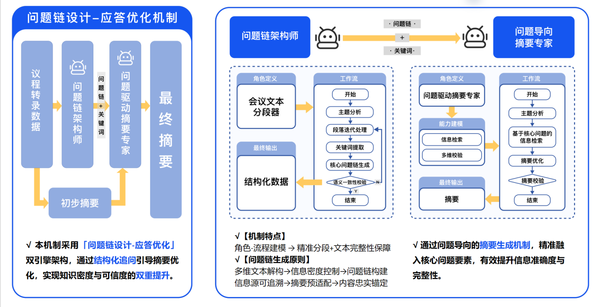
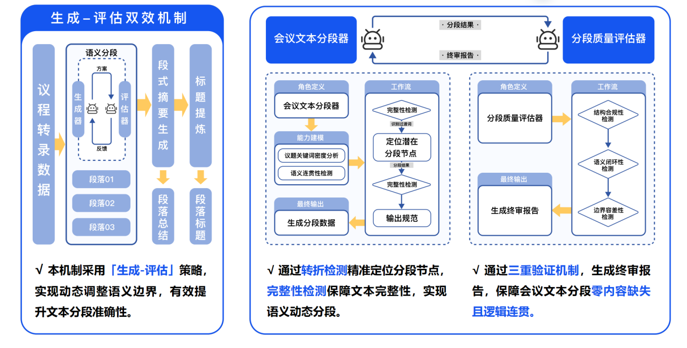
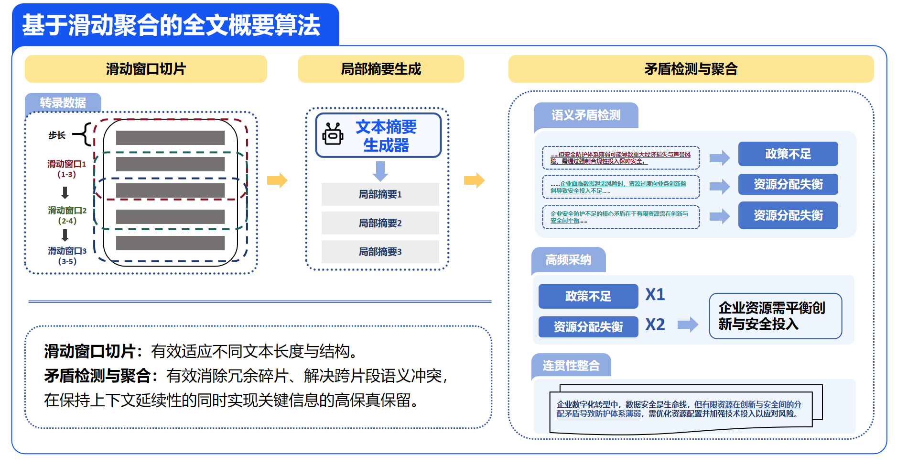
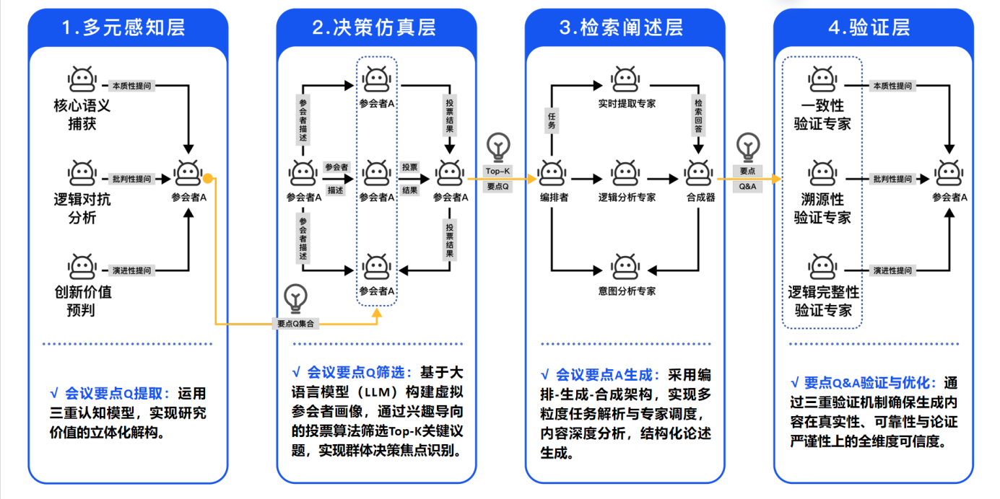

# 第三章 系统体系结构及实现方案

## 系统体系结构

本系统采用五层分布式架构设计，通过模块化组件实现高可用性、弹性扩展能力和智能服务闭环，整体架构由前台应用层、接入交互层、服务支撑层、数据处理层和数据存储层组成，各层级间通过标准化接口实现解耦通信。

<figcaption>产品架构图</figcaption>

### 前台应用层

作为直接面向用户的功能载体，包含四大核心模块：

- 会议导航中心：提供会议检索、订阅、管理，查看当前直播会议和热点会议。
- 智能体交互界面：基于自然语言处理（NLP）的对话式交互入口，实现语音/文本双模交互及多轮对话管理
- 智能会议分析：实时呈现结构化会议内容分析，包括实时转录、知识卡片、章节速览等可视化组件
- 智能会议总结：动态生成多维度会议成果物，包括章节速览、全文概要、思维导图、要点生成和重点/行动项提取。

### 接入交互层

构建统一服务接入平台，包含双重通信协议支持：

- API 网关集群：基于 HTTP/SSE 协议处理标准 RESTful 请求，实现服务路由、负载均衡、鉴权限流等治理功能
- 实时消息网关：采用 WebSocket 协议建立持久化连接通道，支持语音流实时传输、状态同步推送等低延迟场景

### 服务支撑层

作为系统的智能处理中枢，本层构建了对话理解、知识服务、内容生成三位一体的服务体系，由两大核心系统构成：

**（1） 问答交互系统**

构建需求理解-知识检索-内容生成的全链路服务能力：

- 场景化问答引擎

  - 多意图识别：于对话上下文动态识别会议安排咨询、参会指南查询、会议推荐等核心场景
  - 混合检索机制：通过意图识别和实体提取，针对不同意图采取不同的检索策略；如果是“某一会议”的咨询，则采用单个的会议的精准检索，如果是“推荐会议”则采取同义词扩展的扩展检索。
  - 交互式引导：推荐场景存在多个候选结果时，通过分类维度分析（如行业/地区/时间）生成引导话术，实现需求渐进式聚焦。
  - 智能总结引擎：检索结果进行要点提炼，生成场景适配的简洁回答。
  - 合规审查：通过对输入输出过滤机制，实时监测用户与 AI 的双向交互数据，精准拦截潜在风险内容，构建全链路安全防护体系。

**（2）会议分析系统**

实现从语音信息到结构化知识的自动化处理：

- 转录增强服务：

  - 语义增强：通过修正重复冗余表达和术语误用优化 ASR 结果，有效提升内容精炼度与信息密度以及确保信息传递的准确性。
  - 术语解析：动态检测并标记会议中出现的专业术语，帮助消除理解障碍，减少跨领域合作时的认知成本，并促进更有效的知识交流。

- 智能生成服务：

  - 多层级内容构建：提供从段落摘要到全文概览的多层次自动化生成能力，包括章节速览、全文总结以及关键点提炼，以适应不同层次的信息需求。
  - 关键信息抽取：根据会议的具体背景和讨论内容，自动定位并提取出重要议题和行动指南，从而大幅减轻人工整理的工作量，并提升效率。

### 数据处理层

构建高效实时处理流水线，支持语音信息的快速转化与处理：

- 实时语音转码：从视频中提取音频流，并将其转换为标准化的 PCM 编码格式，为后续的语音转写提供高质量的数据基础。
- 流式语音转写：利用端到端的 ASR（自动语音识别）模型，实现低延迟、高精度的实时语音转录，支持中英混合内容的精准识别与翻译，满足多语言场景需求。

### 数据存储层

采用多模数据库集群架构，以支持多样化的数据处理和高效存取：

- 用户数据库：负责存储用户的注册信息，包括基本信息如用户名、联系方式等，确保用户数据的安全性和易访问性。
- 会议元数据库：记录会议相关的核心元数据，包括但不限于会议标题、时间、地点、预期开始与结束时间等，便于会议管理和回顾。
- 语音转写时序库：专门用于存储实时转换的语音文本流，支持快速检索和分析语音内容，保证数据处理的连续性和时效性。
- 转录增强库：保存经过语义优化和术语解析后的转录数据，提升信息的准确性和可用性，为后续处理提供高质量输入。
- 内容生成库集合：包含多个子库，用于存储由系统智能生成的多样化会议内容，如全文概要、思维导图、要点总结等，便于用户根据需要获取全面且结构化的会议资料。

## 实现方案

### 后端业务算法及其实现

#### （1）数据预处理与转录增强

后端通过以下步骤实现语音数据的预处理和转录增强：

1. **语音转码：** 利用 `ffmpeg` 工具将音频流从视频中分离并转换为标准化的 PCM 编码格式，为后续语音处理提供高质量的数据输入。
2. **实时语音转写：** 调用阿里云通义听悟 API 实现实时语音转文字（ASR），支持多语言混合识别和翻译，确保转录结果的准确性和实时性。
3. **文本流处理与增强：**

   1. 转录后的文本流会实时传递给前端，供用户即时查看。
   2. 当检测到句子结束信号时，后端将完整的句子发送至前端，并同步传递给安小恒智能体进行进一步处理。
   3. 安小恒智能体对句子进行语义增强，包括：

      1. 冗余信息过滤：智能识别并去除重复或不必要的表达，提升内容精炼度。
      2. 专业术语校准：动态修正术语误用，确保领域术语的准确性。
      3. 术语解析与知识卡片生成：自动解析专业术语并生成交互式知识卡片，帮助用户快速理解复杂概念。

#### （2）基于问题链驱动的文本摘要生成算法

近年来，文本摘要系统取得了显著进展，但大多数方法通常在单一步骤中生成摘要。尽管预训练语言模型本身蕴含丰富的知识，一次性摘要设置有时仍显不足，因为生成的摘要可能包含不准确的信息（即“幻觉”）或忽略对读者至关重要的细节。

文档摘要旨在通过压缩原始文本材料来保留其核心信息和最重要的细节。然而，如何确保摘要既精确又与读者的兴趣高度相关，是当前技术面临的主要挑战之一。

本项目提出了一种问题链驱动的文本摘要生成算法，旨在通过结构化的追问引导摘要优化，从而提升生成摘要的知识密度和可信度。具体来说，采用了双引擎架构——问题链设计与应答优化机制：

1. 问题链设计：采用角色扮演的概念，设计一个智能体作为问题链架构师。该智能体负责：

   1. 基于初始文本进行主题分析和关键词提取。
   2. 根据分析结果生成核心问题链，并对其进行语义一致性校验。
   3. 确保生成的问题链具有适中的信息密度、可追溯的信息源以及良好的摘要预适配性。

2. 应答优化机制：设计了一个问题驱动的摘要专家，专注于基于问题链优化初步摘要。此过程包括：

   1. 对初步摘要进行进一步的校验和优化，确保精准融入核心问题要素。
   2. 提升摘要的信息准确度和完整性，使其更加符合读者的需求。

以下是具体的技术路线：

<figcaption>文本摘要生成算法图</figcaption>

#### （3）基于生成-评估机制的章节速览生成算法

章节速览旨在通过简明标题和精炼摘要提炼段落要点，实现信息的分层展示。其特点在于语言的高度凝练与逻辑的清晰性，有助于高效吸收会议重点，并作为全局导航提供内容地图，既展示整体框架又保留细节入口。

章节速览通过结构化分段将会议内容分为若干部分，每个部分都配有简洁的标题和摘要，以便于快速理解会议的核心观点。本项目采用了一种先进的生成-评估机制来优化文本的语义分段，确保分段准确性和内容的完整性。

具体来说，会议文本分段器工作如下：

- 初始分段：首先对会议内容进行初步分段，主要步骤包括：
- 转折检测：识别过渡词（如“然而”、“因此”等），以定位潜在的分段节点。
- 分段节点确认：根据过渡词的位置确定分段节点，并进行完整性检测，确保各段落的连贯性和完整性。
- 输出分段结果：经过初步处理后，输出分段结果供进一步评估。

分段质量评估：使用三重检测机制对分段结果进行细致评估，包括：

- 结构合规性检测：检查每一分段是否符合预定义的结构标准，确保逻辑顺畅。
- 语义闭环性检测：验证分段内部是否存在完整的语义闭环，避免信息断裂。
- 边界容错性检测：评估分段边界的合理性，确保没有遗漏关键信息或包含无关内容。
- 终审报告生成：根据上述检测结果生成终审报告，指出需要改进的地方。

迭代改进：分段质量评估器将终审报告反馈给会议文本分段器，帮助其对分段结果进行迭代改进。当终审报告提示方案已通过所有检测时，停止迭代并进入下一步操作。

在完成语义分段后，利用先前描述的文本摘要生成算法对各个分段生成段式摘要。接下来，对这些段式摘要进行进一步提炼，生成简洁且具有代表性的标题。最终，将标题和对应的段式摘要组合成章节速览，为用户提供一个清晰、全面的内容概览。

通过这种生成-评估机制，我们不仅能够提高分段的准确性，还能确保章节速览的质量，使其成为理解和回顾会议内容的有效工具。这种方法不仅能提升用户的阅读体验，还能显著提高信息检索效率。

<figcaption>章节速览生成算法图</figcaption>

#### （4）基于滑动聚合的全文概要生成算法

区别于传统的摘要生成算法，全文概要面临处理长文本的挑战。由于智能体难以直接对长文本进行有效的理解和分析，本项目引入了滑动窗口机制来优化这一过程。

算法设计思路如下：

- 滑动窗口切片：为了解决长文本的问题，采用滑动窗口技术对转录数据进行重叠滑动切片。这种方法不仅能够确保每个片段都足够短以供智能体高效处理，还能通过适当的重叠保持信息的连贯性和完整性。
- 局部摘要生成：利用前述的文本摘要生成算法，针对每一个切片独立生成局部摘要。此步骤旨在提取每个片段的核心内容和关键点，形成初步的摘要集合。
- 语义矛盾检测与解决：

  - 重叠部分的语义一致性检查：对于局部摘要中的重叠部分，实施严格的语义矛盾检测。该步骤用于识别不同局部摘要之间可能存在的不一致或冲突。
  - 高频采纳策略：一旦发现语义矛盾，应用高频采纳策略。根据自洽性原则，如果某个观点在多次生成过程中出现频率较高，则认为它更忠实于原文且更为重要。因此，引导智能体优先采纳出现次数更多的观点，以此来增强最终摘要的一致性和准确性。
  - 连贯性整合：完成上述步骤后，将所有局部摘要进行连贯性整合。这一步骤不仅仅是简单地拼接各个局部摘要，而是注重整体逻辑的流畅性和信息的全面覆盖，确保生成的全文概要既准确又易于理解。

通过这种基于滑动聚合的方法，我们不仅能有效地处理长文本的摘要生成问题，还能够在保证信息完整性的前提下提升摘要的质量。这种方法特别适用于会议记录、讲座笔记等需要从大量原始资料中提炼精华内容的场景，有助于用户快速获取所需信息并做出决策。此外，通过引入高频采纳策略，进一步增强了摘要的真实性和可靠性，使得最终生成的概要更加贴近源材料的核心思想。

> 自洽原则引用：
>
> [Self-Consistency Improves Chain of Thought Reasoning in Language Models](https://arxiv.org/abs/2203.11171#:~:text=In%20this%20paper%2C%20we%20propose%20a%20new%20decoding,the%20naive%20greedy%20decoding%20used%20in%20chain-of-thought%20prompting.)
>
> [SelfCheckGPT: Zero-Resource Black-Box Hallucination Detection for Generative Large Language Models](https://arxiv.org/abs/2303.08896#:~:text=In%20this%20work%2C%20we%20propose%20%22SelfCheckGPT%22%2C%20a%20simple,a%20zero-resource%20fashion%2C%20i.e.%20without%20an%20external%20database.)

<figcaption>全文概要生成算法图</figcaption>

#### （5）基于多元感知的要点总结生成算法

本算法基于多维度认知框架与智能协同机制，通过语义深度解析、虚拟群体决策仿真的内容生成及全链路验证体系，实现对会议核心要点的智能萃取与可信输出。以下是各个层实现的功能：

- 多元感知层：运用三重认知模型，从不同视角解构会议内容的核心价值，为要点提取提供深层次的理解支持。

  - 核心语义捕获：通过主题锚定技术生成本质性质问，提炼关键议题的核心内涵。例如：大模型训练过程中数据安全和隐私保护的关键成因有哪些？
  - 逻辑对抗分析：采用辩证思维提炼批判性质问，揭示潜在问题或挑战。例如：如何在大模型训练和推理的数据保护中解决多方数据集中训练的安全问题？
  - 创新价值预判：聚焦未来发展方向，构建演进性质问，挖掘潜在的创新点。例如：例如，如何实现防火墙的一体化安全运维以适应未来发展？

- 决策仿真层：基于大语言模型（LLM）构建虚拟参会者画像，通过兴趣导向的投票算法筛选 Top-K 关键议题，实现群体决策焦点识别。

  - 参会者画像构建：通过对虚拟参会者的职业背景、研究偏好进行多维度特征建模，为核心要点筛选提供个性化数据支撑。
  - 参会者兴趣锚定：通过兴趣驱动的投票筛选 Top-K 核心要点，完成群体智力焦点的动态模拟。

- 深度阐述层：采用动态编排-合成机制与混合专家（Mixture of Experts, MoE）相结合的方式，实现对核心要点的多维度分析与高质量阐述。

  - 任务分解与专家调度：编排器通过对任务的语义解析，将复杂问题分解为多个子任务，并根据需求调度相应的领域专家模型。
  - 专家分析与结果整合：各领域专家模型基于会议内容分别进行深入分析，分析结果由合成器汇总并生成最终阐述，确保内容兼具专业性与全面性。

- 验证层：引入三重验证机制，确保生成的要点总结在事实准确性、逻辑完整性以及数据溯源性方面均达到高标准。

  - 一致性验证：标注内容并交叉对比，验证文本的[事实/数据/观点]一致性。
  - 溯源性验证：标注专业/争议性内容，基于知识库验证数据是否存在。
  - 逻辑完整性验证：通过[论点、论据、结论]结构拆解和批判反思，验证论证的逻辑性。

<figcaption>要点总结生成算法图</figcaption>

### 应用对象和环境

#### （1）应用对象

本项目依托安恒信息“恒脑·安全垂域大模型”，专为西湖论剑·数字安全大会场景打造智能体会议助手，聚焦网络安全领域核心用户需求：面向政府、企业及学术机构的安全决策者、网络安全从业者与研究者，提供移动端实时直播接入、AI 智能问答、演讲内容实时转录及安全垂域语义搜索等功能，通过大模型的上下文理解能力和安全知识库关联，实现会议内容智能解析、攻防案例推演辅助及技术要点回溯，助力用户高效获取高密度安全知识，沉淀可操作的行业洞见。

#### （2）应用环境

本系统原理上可以支持市面上所有 Android8.0+版本与 iOS12.0+版本的主流手机。

#### （3）开发环境

1. 服务器：基于 Spring Boot 3.4.3 构建的 Java 服务器
2. 数据库：MYSQL
3. 运行环境：android、ios
4. 开发工具：react native，IntelliJ IDEA，DataGrip，Apifox
