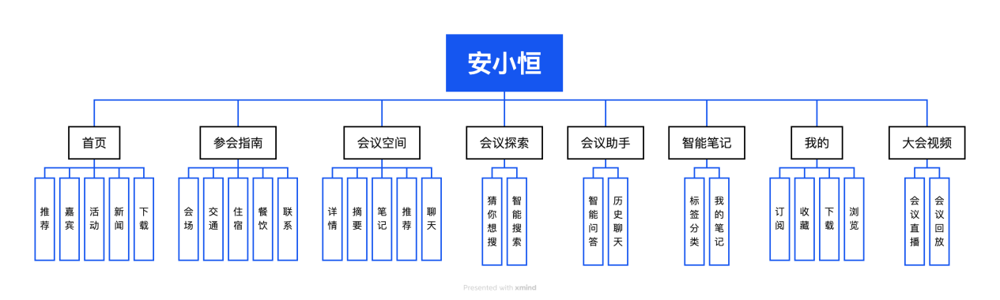

import MdxFigure from "../../src/components/MdxFigure";

# 第四章 功能简介

## 应用信息架构

在“安小恒·AI 会议助手”的项目策划中，我们团队以“会议”为核心，精心设计了信息架构图，将功能划分为多个模块，并细化到具体功能点如直播预告、会场服务等，为开发和用户体验优化奠定了坚实基础。

这张图为我们提供了一张全面的功能蓝图，确保开发过程中覆盖参会全流程需求，同时通过清晰的层级划分优化信息组织，让用户能快速导航，比如从“我的”查看订阅，或从“参会指南”获取交通信息。它还为前端开发（基于 React Native、Material Top Tabs 导航）和 AI 智能体集成（推荐、提醒）提供了明确指引，帮助我们对齐用户需求，方便团队协作，并为未来迭代预留了扩展空间。

<figcaption>安小恒功能模块图</figcaption>

## 功能与界面介绍

### 首页

  

    <MdxFigure src={require("./img/4-2-1.png").default} desc={"推荐界面"} />
  

  

    <MdxFigure src={require("./img/4-2-2.png").default} desc={"嘉宾界面"} />
  

  

    <MdxFigure src={require("./img/4-2-3.png").default} desc={"活动界面"} />
  

  

    <MdxFigure src={require("./img/4-2-4.png").default} desc={"新闻界面"} />
  

  

    <MdxFigure src={require("./img/4-2-5.png").default} desc={"下载界面"} />
  

#### 推荐

推荐界面通过 AI 智能体为参会者提供个性化的内容导航，包含**直播推荐**和**回放推荐**两大功能。

直播推荐基于用户兴趣和实时会议动态，精准推送正在进行的精彩直播场次，如技术论坛或圆桌讨论，确保用户不错过核心内容；回放推荐则智能筛选已结束场次的高质量视频，结合用户历史浏览行为，推荐与个人偏好匹配的演讲或讨论录像。界面采用卡片式布局与轮播图，支持一键跳转观看，提升参会者获取信息的效率，让用户轻松锁定最具价值的会议内容。

#### 嘉宾

嘉宾界面为参会者提供全面的专家信息展示，涵盖**专家委员会**和**大咖演讲**两大模块。其中，大咖演讲细分为本届嘉宾和往届嘉宾。专家委员会展示本届大会的核心评审与顾问团信息，包括专业背景和贡献，助力用户了解权威力量。

用户可通过本届嘉宾查看当前大会的演讲者简介、演讲主题及时间安排，或浏览往届嘉宾回顾历年亮点。

#### 活动

活动界面整合大会的多元互动内容，包含 **数字成果展** 、 **新品发布** 、 **安全特训营** 、**创新案例实践征集**和**奋进十二年**五大板块。数字成果展展示前沿技术成果，新品发布聚焦最新产品动态，安全特训营提供专业培训机会，创新案例实践征集鼓励用户参与创意分享，而奋进十二年回顾大会历史成就。

#### 新闻

新闻界面是大会资讯的实时窗口，包含 **新闻前线** 、**精彩视频**和**精彩图片**三大功能。新闻前线提供最新的会议动态和行业快讯，确保用户掌握第一手信息。精彩视频精选大会现场的高光片段，如演讲片花或采访片段，供用户快速回顾。精彩图片则呈现专业摄影作品，捕捉会场氛围与亮点瞬间。

#### 下载

下载界面为参会者提供便捷的资源获取渠道，涵盖 **大会 PPT 集锦** 、 **政策文献与实务指南** 、**大会议程海报**和**嘉宾海报**四大类内容。大会 PPT 集锦整理各场次演讲的精华幻灯片，政策文献与实务指南提供权威参考资料，大会议程海报和嘉宾海报则以高清图片形式便于用户保存和分享。

### 参会指南

  

    <MdxFigure src={require("./img/4-3-1.png").default} desc={"会场界面"} />
  

  

    <MdxFigure src={require("./img/4-3-2.png").default} desc={"交通界面"} />
  

  

    <MdxFigure src={require("./img/4-3-3.png").default} desc={"住宿界面"} />
  

  

    <MdxFigure src={require("./img/4-3-4.png").default} desc={"餐饮界面"} />
  

  

    <MdxFigure src={require("./img/4-3-5.png").default} desc={"联系界面"} />
  

#### 会场

会场界面为参会者提供全面的场地信息与服务支持，涵盖 **会场分布** 、**会场服务**和 **无障碍服务** 。会场分布展示各会场位置、功能分区，帮助用户快速定位目标会场。会场服务提供行李寄存、签到指引、胸卡领取和差旅报销等实用功能，确保参会顺畅。无障碍服务展示轮椅通道、无障碍电梯等设施详情，体现大会包容性，并提升用户在复杂会场中的移动效率。

#### 交通

交通界面优化参会者的出行体验，包含**智能地图**和**接驳服务**两大功能。智能地图显示会场周边交通枢纽、停车场及步行路径。接驳服务提供大会路线查看、班车时刻表、线上预约及专车服务功能，助力参会者准时抵达。

#### 住宿

住宿界面为参会者提供便捷的酒店信息与安排服务，聚焦**酒店安排**功能。用户可浏览大会推荐酒店的详细信息，包括位置、接驳负责人及联系方式。

#### 餐饮

餐饮界面为参会者提供高效的就餐支持，包含**会场餐饮公示**和**公务餐预定**两项功能。会场餐饮公示展示各餐饮点的菜单、营业时间及健康认证信息，支持按口味或饮食限制筛选（如素食、无麸质）。公务餐预定允许用户提前订购定制餐食，满足正式会议或商务宴请需求。

#### 联系

联系界面是参会者的沟通枢纽，涵盖 **会务咨询** 、**商务合作**和**后勤安保部门**三大板块。会务咨询提供大会组委会的联系方式及常见问题解答；商务合作展示赞助商联络渠道和合作流程，方便商务洽谈；后勤安保部门列出应急电话和现场服务点位置，确保安全无忧。

### 大会视频

  

    <MdxFigure src={require("./img/4-4-1.png").default} desc={"直播界面"} />
  

  

    <MdxFigure src={require("./img/4-4-2.png").default} desc={"回放界面"} />
  

#### 会议直播

会议直播界面为参会者提供实时观看大会精彩内容的入口，涵盖 **当前直播** 、 **我的直播订阅** 、**直播预告**和**直播观看历史**四大功能。当前直播展示正在进行的场次（如主题演讲或技术论坛），支持通过 Expo Video 模块实现高清流畅播放。我的直播订阅允许用户关注感兴趣的直播，AI 智能体根据订阅偏好推送实时开播提醒。直播预告列出即将开始的场次及时间表，便于规划观看。直播观看历史记录已观看内容，支持快速回溯。

#### 会议回放

会议回放界面帮助参会者随时重温大会精华，包含**热门回放推荐**和**回放观看历史**两大功能。热门回放推荐由 AI 智能体驱动，基于用户兴趣和大会热度，精选高质量视频（如大咖演讲或圆桌讨论）。回放观看历史记录用户已观看的视频，支持续播和收藏，方便后续复习。界面利用 Expo Video 的离线缓存功能，确保视频加载流畅，即使网络不佳也能稳定播放。AI 智能体还可根据日程推荐相关回放，助力参会者高效获取知识，弥补错过直播的遗憾。

### 智能笔记

  

    <MdxFigure src={require("./img/4-5-1.png").default} desc={"标签分类界面"} />
  

  

    <MdxFigure src={require("./img/4-5-2.png").default} desc={"我的笔记界面"} />
  

#### 标签分类

标签分类界面为参会者提供结构化的笔记管理方式，包含 **重点** 、**疑惑**和**代办**三大标签类别。重点标签用于记录演讲中的核心观点或关键信息，疑惑标签帮助用户标记未解问题以便后续查阅，代办标签支持添加与大会相关的待办事项（如联系嘉宾、报名活动）。

#### 我的笔记

我的笔记界面是参会者的个性化记录中心，支持 **新建** 、 **置顶** 、 **分类** 、**编辑**和**删除**五大功能。用户可随时新建笔记记录灵感，置顶重要笔记以便快速访问，通过分类功能整理笔记。编辑功能支持富文本和语音输入，删除功能则确保灵活清理。

### 我的

  

    <MdxFigure src={require("./img/4-6-1.png").default} desc={"订阅界面"} />
  

  

    <MdxFigure src={require("./img/4-6-2.png").default} desc={"收藏界面"} />
  

  

    <MdxFigure src={require("./img/4-6-3.png").default} desc={"下载界面"} />
  

  

    <MdxFigure src={require("./img/4-6-4.png").default} desc={"浏览界面"} />
  

#### 订阅

订阅界面为参会者提供个性化的内容跟踪服务，涵盖 **回放会议** 、 **直播会议** 、**预定会议**和**各类活动**四大功能。用户可订阅感兴趣的直播或回放场次（如技术论坛、圆桌讨论），获取开播提醒；预定会议支持报名主题演讲或工作坊；各类活动则包括数字成果展、新品发布等动态跟踪。

#### 收藏

收藏界面帮助参会者保存喜爱的资源，包含 **大咖演讲** 、 **新闻前线** 、**精彩视频**和**精彩图片**四大类内容。用户可收藏大咖演讲的视频或讲义以便随时复习，新闻前线保存重要资讯，精彩视频和图片则保留大会高光时刻。

#### 下载

下载界面为参会者提供便捷的资源获取渠道，包括 **PPT 集锦** 、 **政策文献与实务指南** 、**议程海报**和 **嘉宾海报** 。PPT 集锦汇集各场次核心幻灯片，政策文献与实务指南提供权威参考，议程和嘉宾海报是会议的重要资源。

#### 浏览

浏览界面记录参会者的历史足迹，涵盖 **回放会议** 、 **直播会议** 、 **各类活动** 、 **大咖演讲** 、 **新闻前线** 、**精彩视频**和**精彩图片**七大类内容。用户可查看已观看的直播或回放视频、参与的活动、浏览的演讲、资讯及多媒体内容。
